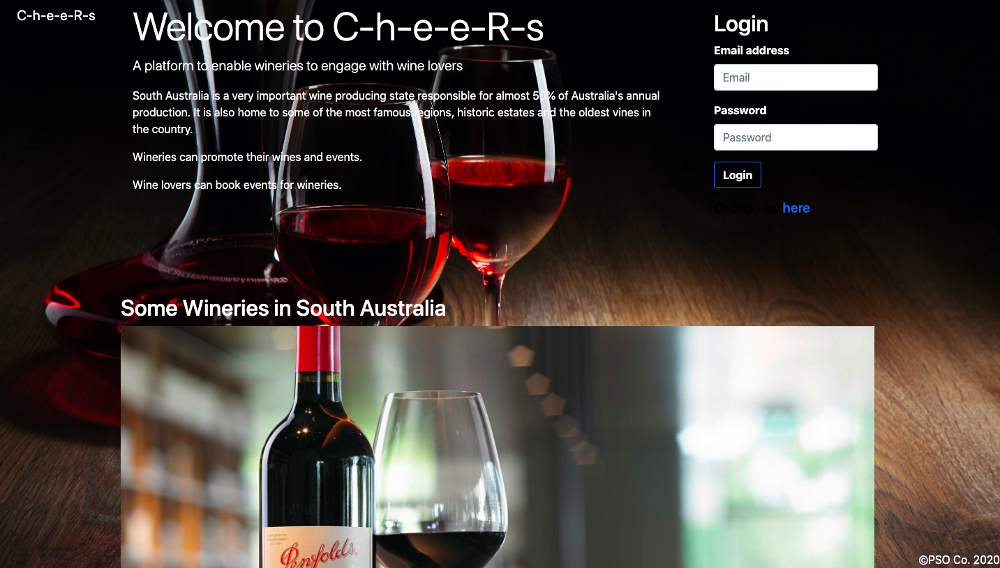

# C-h-e-e-R-s

# Client Brief

AS THE Wine lovers
WHEN I _use the app_ find relevant wine data and find new wine stores in Adelaide.
I also want to be able to book available wineries events 
I WANT TO: Know more about the wine industry and local producer.

AS THE _vinyard owner_
I WANT TO _promote my popular wines/vinyards_
SO I CAN _so that i can reach a larger audience, by enable events boooking and 

# CONCEPT 
Our clients are the Wineries, the wines consumers and vendors of Adelaide. This platform connects these three words. To bring new wine experiences and foment new connections.

# Built With
| HTML | CSS | JavaScript | Node.js | Sequelize | Express-Handlebars. 

# Deployment
<a href="https://limitless-mesa-21447.herokuapp.com/" target="_blank">C-h-e-e-R-s</a>

# Screenshot

# Authors
PangSzee Ong

